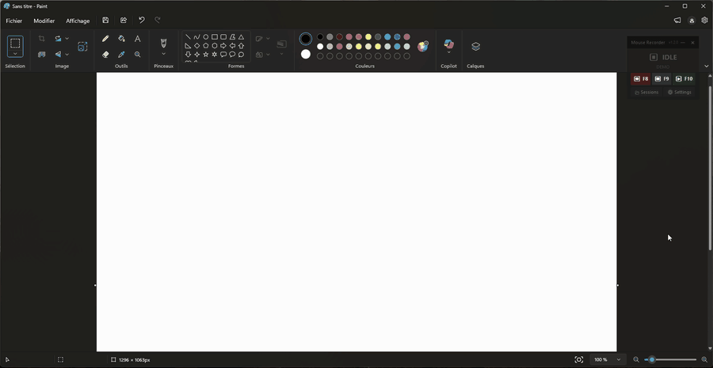

# ClickClick

**Record your clicks, scrolls, mouse moves and keystrokes — then replay them as many times as you want.**

[](https://github.com/Shult/click_click/releases/latest)
[](https://github.com/Shult/click_click/actions/workflows/ci.yml)
[](LICENSE)


*Read this in [français](README.fr.md).*

<p align="center"></p>

<p align="center"><sub>Recorded once in Paint, then replayed on its own — the overlay turns transparent and clicks pass straight through it.</sub></p>

A floating overlay that stays on top of every window, named sessions saved to disk, a queue to chain several of them, and adjustable speed and repeat count. No installer, no account, no network — beyond an anonymous update check you can turn off.

## Download

Grab **[`ClickClick.exe` from the latest release](https://github.com/Shult/click_click/releases/latest)** and drop it wherever you like. It creates `sessions/`, `settings.json` and `clickclick.log` next to itself. Windows 10/11, nothing else to install. From then on the app updates itself.

> **The executable is not code-signed** and it installs a global keyboard hook, so SmartScreen will warn you (*More info* → *Run anyway*) and some antivirus products may flag it. See [What it does with your input](#what-it-does-with-your-input) below, or [build it from source](#development) if you would rather not take my word for it.

## What it does with your input

Everything stays on your machine.

- Recorded sessions are plain JSON files sitting next to the executable. You can read them, edit them, delete them.
- **No telemetry, no analytics, no account.** The only network request the app ever makes is an anonymous `GET` to the GitHub releases API, to compare its version number against the latest release. Turn it off with `"update_check": false` in `settings.json` and it makes none at all.
- The global keyboard hook is what makes recording keystrokes and global hotkeys possible. It is also, unavoidably, what makes the binary look like a keylogger to an antivirus. The source is right here, and `pyinstaller ClickClick.spec` reproduces the executable.

## Interface

The overlay sits in the top-right corner of the screen and stays visible above every other window.

During **playback** it turns transparent and clicks pass straight through it — you keep interacting with your application normally.

| Button | Shortcut | Action |
|--------|----------|--------|
| ⏺ | **F8** | Start recording |
| ⏹ | **F9** | Stop and save |
| ▶ | **F10** | Start playback (the loaded session, or the queue) |
| — | **F11** | Hide / show the overlay |
| · | **Esc** | Stop playback |
| × | **F12** | Quit |

These six keys are reserved: they are never recorded into a session.

### Hiding the overlay

**F11**, or the `—` button in the header, tucks the overlay away without stopping anything: the shortcuts stay live, and a recording or playback in progress carries on. F11 brings it back, in the same place and still on top. Stopping a recording (F9) shows it again on its own, so the save dialog does not float without context.

The hidden state is **not persisted** across restarts: an application that starts up invisible looks like an application that failed to start.

> There is no notification-area icon (yet): it would mean either `pystray` + `Pillow`, or a hand-rolled `Shell_NotifyIcon` implementation in `winapi.py`. F11 does the same job without weighing on the executable size.

### Sessions

The **📂 Sessions** panel lists everything saved on disk in a scrollable list — no more ten-entry ceiling. The field in the top right **filters by name** (case-insensitive, Esc clears it); the counter under the list shows how many sessions match.

A **click** selects a session, a **double-click** loads it. The four buttons act on the selected one:

| Button | Effect |
|--------|--------|
| Load | Loads the session (same as double-clicking) |
| Rename | The name is validated as it is on save; a name already taken is refused |
| Duplicate | Copies under the first free name `name (2)`, `name (3)`… original metadata preserved |
| Delete | **Irreversible**: asks for confirmation, then erases the file without going through the recycle bin |

The active session shows in green. Rename it and it stays active under its new name; delete it and the header falls back to `—`, but the events already loaded stay in memory — a playback in progress is not interrupted and F10 still works.

### Playback queue

To play several sessions back to back, add them to the **queue** at the bottom of the Sessions panel. `＋ Add selected session` appends it; `↑` `↓` move it, `Remove` takes it out, `Clear` empties the queue (with confirmation). The same session can appear several times.

**As soon as the queue holds one entry, it takes precedence over the loaded session**: F10 plays the queue, in order, and the overlay header shows `⛓ queue: N session(s)` so it is visible without opening the panel. To replay a single session, clear the queue.

During playback the header shows the current session and its position: `alma 03 (2/14)`. Repeats apply to **the whole chain**: 3 repeats of a 4-session queue is twelve playbacks. The delay acts as a pause between two sessions just as it does between two passes.

The queue is **persisted** in `settings.json` as a list of names, and follows renames and deletions made from inside the app. An entry whose file has disappeared some other way (deleted from Explorer) shows up **in red** in the list and is simply skipped during playback — the rest of the chain plays anyway.

Every session releases the mouse and keyboard before the next one starts: an unbalanced session cannot leave a key held down for the whole rest of the queue.

### Settings

| Setting | Description |
|---------|-------------|
| Repeats | How many times the session is played. **Click the number** to type it directly (Enter confirms, Esc cancels); **∞** replays until Esc |
| Delay (s) | Pause between each pass, and between two sessions of a queue |
| Speed | Playback tempo, from **0.25×** to **4×** in steps (0.25, 0.5, 0.75, 1, 1.5, 2, 3, 4) |
| Skip moves | Ignores mouse movements during playback |
| Language | Interface language — see below |

In infinite mode the status shows the current pass over `∞` — `▶ PLAYING (37/∞)`. An input that is not an integer ≥ 1 is refused without changing anything. The number of passes is frozen when playback starts: changing the setting midway only affects the next playback.

Speed divides the recorded timestamps: at 2× a 30 s session takes 15. It does **not** apply to the delay, which is a deliberate pause rather than recorded rhythm. Like repeats, it is frozen when playback starts.

> Past 2×, the application being driven may not keep up: a menu that takes 200 ms to open will not open any faster because the next click arrives sooner. A session that fails at 4× is not necessarily badly recorded.

### Language

The interface is in **English by default**. The `Language` button in the Settings panel cycles through the available languages — currently **English** and **Français** — and the overlay redraws immediately in the new one, open panel included. The choice is kept in `settings.json`.

Each language is shown in its own language (`Français`, never `French`): it is the one label that has to stay readable to someone who cannot read the interface in front of them.

The log, on the other hand, is **in English** under all circumstances: it is not translated and does not follow this setting. A trace gets compared across machines, pasted into an issue and searched for on the web — three things a translation makes harder. Code comments are in French.

> To add a language: one more dictionary in `i18n.py`, declared in `LANGUAGES`. A test checks that no key is missing — an incomplete language would show English in the middle of everything else. Failing that, any absent key falls back to English rather than bringing the window down.

### Persistence

These settings, the language, the playback queue, the sort order of the session list and the overlay position are **kept from one launch to the next** (`settings.json`). A file that is missing, unreadable or inconsistent is ignored silently: the app falls back on its defaults, key by key — so a `settings.json` written by an earlier version loads without losing anything else.

```jsonc
{
  "play_times": 0,              // 0 = infinite, otherwise 1 to 9999
  "play_delay": 3.0,
  "play_speed": 1.5,            // 0.25 to 4
  "play_skip_moves": false,
  "playlist": ["login", "daily-run", "logout"],
  "sort_by_date": true,
  "window_pos": [1670, 20],
  "language": "fr",          // "en" by default
  "update_check": true       // check for updates at startup
}
```

The file can be edited by hand safely: every questionable value falls back to its default, and a `playlist` entry that is not a valid session name is dropped.

## Updating

At startup the executable compares its version against the [latest GitHub release](https://github.com/Shult/click_click/releases/latest). If a newer one exists, an **`⬆ version`** badge appears in the header, next to the version number. Nothing installs on its own: clicking the badge offers to download and restart, and that is all.

During installation the old executable is renamed `ClickClick.old.exe` for the duration of the swap, then deleted on the next launch. Sessions, settings and log are left alone. On failure (no network, corrupted download) the badge shows `⚠`, the app carries on with the version in place, and the details are in the log — clicking again retries.

- The check is **silent and non-blocking**: offline, the app starts as if nothing happened.
- It only runs from the packaged executable, never in development.
- To turn it off: `"update_check": false` in `settings.json`. No other data is sent — it is an anonymous request to the GitHub API.
- The badge is inert during a recording or a playback: installing restarts the app, and it will not interrupt a routine in progress.

## What gets recorded

- Mouse clicks (left, right, middle)
- Scrolling
- Mouse movements (sampled at 60 Hz)
- Keystrokes (held keys, combos)
- Drag & drop

Stopping a recording while a key is held or a drag is in progress closes the press automatically: a session is always balanced, and replay cannot leave a key stuck down.

## Where the files live

Everything is stored **next to the executable** (or the source folder in development), whichever directory the app was launched from:

```
ClickClick.exe
sessions/          ← one session per .json file
settings.json      ← playback settings, queue, sort order, position
clickclick.log     ← log, rotating (4 × 1 MB)
```

If that folder is read-only, everything falls back to `%LOCALAPPDATA%\ClickClick`. The `CLICKCLICK_HOME` environment variable forces a location.

When something goes wrong, the log is the first place to look: the app is packaged without a console, so nothing is printed to screen.

## Session format

```jsonc
{
  "version": 2,
  "app": "ClickClick",
  "created_at": "2026-07-27T12:34:56+00:00",
  "duration": 36.0,
  "event_count": 6126,
  "screen": { "x": -1080, "y": 0, "w": 4920, "h": 1920, "monitors": 3 },
  "events": [ { "type": "move", "x": 1696, "y": 610, "t": 0.117 }, ... ]
}
```

**v1** sessions (a bare array of events, no metadata) are still readable as-is; they are rewritten as v2 on the next save.

Coordinates are **absolute**. `screen` records the desktop geometry at recording time: if it differs when loading, the overlay shows `⚠ (different screen)` and the replay will be offset. Replayed positions are clamped to the current virtual desktop.

On write, movements repeating the previous position are dropped and timestamps rounded to the millisecond — no loss for replay, for roughly two thirds off the file size.

**Editing a session by hand is a supported use** — rewriting timestamps to speed up a replay, for instance. Playback re-reads the file whenever it changed on disk since it was loaded, so an edit takes effect on the next run with nothing to reload by hand. A file that has *disappeared* changes nothing: what is already in memory stays playable.

## Development

```powershell
uv sync
uv run python mouse_recorder.py
uv run pytest
```

Or double-click **`lancer.bat`**, which installs `uv` and the dependencies on first run, then starts the app.

| Module | Role |
|--------|------|
| `mouse_recorder.py` | Entry point, global hotkeys |
| `overlay.py` | Tkinter interface |
| `recorder.py` | Event capture |
| `player.py` | Replay and safety release |
| `sessions.py` | Serialization, compression, v1 compatibility |
| `settings.py` | Persisted preferences |
| `updater.py` | Update check and installation |
| `i18n.py` | Interface strings, one language per dictionary |
| `paths.py` | File location resolution |
| `winapi.py` | DPI, timer, screen geometry, click-through |
| `logs.py` | Logging and exception capture |

Contributions are welcome — open an issue first for anything substantial. Code comments are in French; interface strings and log messages are in English.

### Building the executable

```powershell
uv run pyinstaller ClickClick.spec
```

Releases are built by [`.github/workflows/release.yml`](.github/workflows/release.yml) when a `v*` tag is pushed, and the SHA-256 of the executable is published in the release notes.

> The executable is not signed and installs a global keyboard hook: Windows SmartScreen and most antivirus products will flag it. UPX is disabled in the `.spec` to limit false positives, but only code signing actually solves the problem. Updates installed by the app itself do not go through SmartScreen: a file downloaded by a program does not carry the mark of the web.

## License

[MIT](LICENSE).
